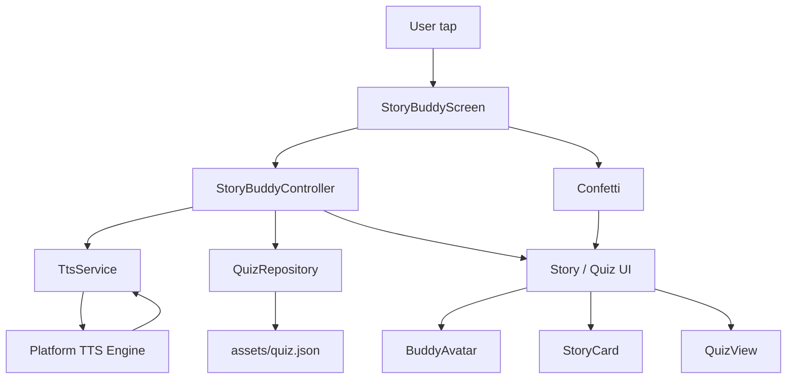
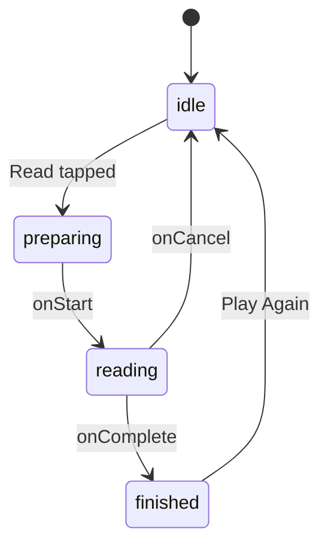

# AI Story Buddy & Quiz 📖🤖

A single‑screen, kid‑friendly mobile app (Flutter) built for the Peblo
**"AI Story Buddy & Quiz Component"** challenge. Buddy reads a short story snippet
**aloud**, and the moment the narration finishes the app smoothly reveals a
**data‑driven** quiz. Correct answers celebrate with confetti + a smiling Buddy;
wrong answers gently shake the card (with haptics) and invite another try.

Built with the **primary audience in mind — children in India on mid‑range
Android (~3GB RAM)**: smooth, lightweight, and resilient when the network or TTS
engine misbehaves.

---

## ✨ What it does

1. **Story screen** — Buddy (a friendly robot), the story in a **scrollable
   card**, and a big **"Read Me a Story"** button — all fitted on one screen.
2. **Read aloud + follow along** — text‑to‑speech narrates while the **current
   word is highlighted** and the text **auto‑scrolls** to keep pace. A
   **draggable progress bar** (shown once you tap Read) lets you scrub anywhere —
   the voice and the highlight jump to where you drop it. Includes a *Preparing…*
   state and graceful failure handling.
3. **Auto‑reveal quiz** — when narration completes, the quiz (rendered from JSON)
   fades in.
4. **Interactive quiz** — wrong → the option **shakes** + haptic + "try again";
   correct → **confetti + Buddy smiles/bounces** and a Success state with a
   "Read it Again" button.
5. **Fits any screen** — phone, tablet or laptop: the header, Buddy, story and
   button always fit; long content scrolls inside its card.

The story snippet (from the brief):

> "Once upon a time, a clever little robot named Pip lost his shiny blue gear in
> the Whispering Woods..."

The quiz (loaded from [`assets/quiz.json`](assets/quiz.json)):

```json
{
  "question": "What colour was Pip the Robot's lost gear?",
  "options": ["Red", "Green", "Blue", "Yellow"],
  "answer": "Blue"
}
```

---

## 📹 Demo

Watch the app in action:

[View Demo Video](https://drive.google.com/drive/folders/17UBTk8hBkeBWwb2JpIbtMPVH5rct598X)

---

## Architecture overview

### App architecture



### Narration state flow



---

## 1. Framework choice & why — **Flutter**

- **One codebase, true to the audience.** The primary target is mid‑range
  Android; Flutter ships a small, fast AOT‑compiled binary and renders its own
  widgets, so the joyful UI looks identical across the many cheap Android devices
  common in India.
- **60fps animations are first‑class.** Shake, confetti, the size/fade reveal and
  the avatar all run on Flutter's compositor with simple `AnimationController`s.
- **Batteries included for this task.** `flutter_tts` (native engine, no network)
  and `confetti` cover the brief with minimal custom code; Poppins is bundled.

## 2. The transition between audio ending and the quiz appearing

State lives in a single `ChangeNotifier`, `StoryBuddyController`, with an explicit
narration lifecycle:

```
idle → preparing → reading → finished → (quiz revealed)
                         └──→ failed (friendly error + retry)
```

- Tapping **Read** sets `preparing` and calls `TtsService.speak`.
- The engine's **start** handler moves us to `reading`.
- The engine's **completion** handler (a real callback, *not* a timer) sets
  `finished` and flips `quizRevealed = true`.
- The view watches `quizRevealed` and swaps `StoryView → QuizView` inside an
  `AnimatedSwitcher` (a **Fade + slide** transition). Buddy stays mounted and
  just changes mood.

Because the reveal is driven by the **completion callback**, the quiz appears
exactly when the audio ends — never early, never on a guessed delay. A manual
**Stop** uses the *cancel* handler, which returns to `idle` without revealing.

## 3. Data‑driven quiz (handles a different question / option count)

The renderer never hardcodes the question. `QuizQuestion.fromJson` parses the
backend shape and resolves the answer index:

```dart
factory QuizQuestion.fromJson(Map<String, dynamic> json) {
  final options = (json['options'] as List).map((o) => o.toString()).toList();
  final correctIndex = options.indexOf(json['answer'] as String);
  // ...validates question/options/answer and that the answer exists
}
```

The UI builds options with a simple loop, so **3, 4 or 5 options just work**:

```dart
for (int i = 0; i < quiz.options.length; i++)
  OptionCard(label: quiz.options[i], state: _stateFor(c, i), ...)
```

Swap `assets/quiz.json` (or point the repository at a real endpoint) and the
screen re‑renders with zero code changes. Unit tests cover 3‑, 4‑ and 5‑option
payloads and malformed JSON.

## 4. Caching approach

- **Quiz data:** loaded once at startup and held in the controller for the
  session (in‑memory). For offline‑first, persist the last good payload to disk
  (e.g. `path_provider` + a JSON file or `shared_preferences`) and read‑through on
  launch.
- **Audio:** the native engine **synthesizes on‑device**, so there is no network
  fetch and nothing to cache — which is exactly why it's a great fit for flaky
  connectivity.
- **If we used a remote TTS API (e.g. ElevenLabs):** cache the returned audio
  bytes in the app cache dir keyed by `hash(text + voice + rate + pitch)`, with an
  LRU size cap, and check the cache before calling the API (`flutter_cache_manager`
  is a good fit). Pre‑warm the *next* page's audio while the child listens, and
  respect HTTP cache headers.

## 5. Audio loading & failure states

- **Loading:** `preparing` shows a spinner + *"Preparing the story…"* and disables
  the button.
- **Reading:** a **Stop** button (cancel handler returns to idle).
- **Failure:** `TtsService.speak` catches `MissingPluginException` /
  `PlatformException` and returns `false`; on a real failure the app **quietly
  returns to the "Read Me a Story" button** so the child can simply tap again —
  no alarming message. Cancellation "errors" (fired by the browser when we stop
  to **seek**) are recognised and ignored. The app never hangs or crashes —
  verified by a widget test that forces a failure and then succeeds.
- **One consistent voice:** a single on‑device voice is used throughout, so its
  word‑boundary highlighting keeps working after a seek.

## 6. Performance & staying lightweight on mid‑range Android

Techniques actually applied:

- **Scoped rebuilds.** `context.select`/`Selector` mean the avatar rebuilds only
  when its *mood* changes, and the quiz subtree rebuilds only on quiz state — not
  the whole screen on every tap.
- **`RepaintBoundary`** around the continuously‑spinning avatar isolates its layer
  so its animation doesn't repaint the story/quiz.
- **Fast, offline start.** Poppins is **bundled** (no runtime font fetch), and
  Buddy/the gear are drawn with shapes — quick first paint and tiny memory on
  3GB devices.
- **`const` everywhere** to avoid rebuild allocations; a single screen with no
  route‑stack overhead.
- **On‑device TTS** → no network on the hot path.

**How to profile (and where to drop the screenshot):**

```bash
flutter run --profile -d <android-device>
# DevTools → Performance → Record while: tap Read → reveal → tap options → confetti
```

Watch the frame chart for UI/raster spikes over 16ms. The change that most helped
in dev was scoping rebuilds with `select` + adding the `RepaintBoundary` around
the avatar (before: the spinning gear dirtied the whole screen each frame; after:
an isolated layer).

## 7. AI usage & judgment

- **System design:** I designed the app architecture, the narration lifecycle,
  the quiz reveal flow, and the offline-friendly TTS strategy.
- **Implementation:** I built the state, UI, and story/quiz interaction myself,
  and I kept the experience simple and robust for low-end Android.
- **AI role:** GitHub Copilot was used only as a lightweight coding assistant
  for small implementation suggestions and README phrasing — the core design
  and feature decisions were mine.
- **Note:** the app relies on native device TTS for the best offline reliability.

---

## 🗂 Project structure

```
lib/
  main.dart                      App + Provider wiring
  theme/app_theme.dart           Colours (#6F2BC2 / #36165E) + Poppins
  models/quiz_question.dart      QuizQuestion + fromJson (data-driven)
  data/
    story_content.dart           The (longer) story to narrate
    quiz_repository.dart          Loads quiz JSON (injectable AssetBundle)
  services/tts_service.dart       TtsService interface + FlutterTtsService
  state/story_buddy_controller.dart   ChangeNotifier: narration + highlight + quiz
  widgets/
    app_header.dart  buddy_avatar.dart  primary_button.dart  option_card.dart
  screens/story_buddy_screen.dart      The single, responsive screen (story ⇄ quiz)
assets/quiz.json                 The backend-shaped quiz payload
assets/fonts/Poppins-*.ttf       Bundled font (no runtime fetch)
test/                            model + controller + widget tests
```

## 🚀 Run it

```bash
flutter pub get

# Primary target — Android (needs Android Studio / SDK):
flutter run -d <android-device>
flutter build apk --release

# Quick preview anywhere:
flutter run -d chrome
```

## ✅ Quality

```bash
flutter analyze   # clean
flutter test      # 15 tests passing (model, controller, widget flow)
```

## 📦 Dependencies

`provider` (state) · `flutter_tts` (narration) · `confetti` (celebration).
Poppins is bundled under `assets/fonts/` (no runtime font fetch).
